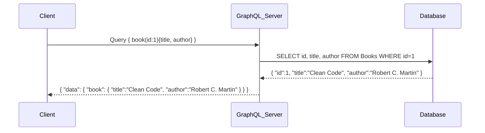

# 🚀GraphQL

GraphQL is a **query language for APIs** and a **runtime** to execute those queries. It’s a modern alternative to REST with several advantages:

* **Client-driven queries** → The client specifies exactly what data it needs (no more over-fetching or under-fetching).
* **Strongly typed schema** → Everything is defined in a type system (like contracts between client and server).
* **Single endpoint** → Instead of multiple REST endpoints, you interact through one `/graphql` endpoint.
* **Real-time capabilities** → Subscriptions allow pushing updates to clients (like WebSockets).
* **Introspection** → Clients can query the API itself to know what data and operations exist.
* **Tooling** → Integrated playgrounds, schema explorers, auto-doc generation.

---

# 🛠️ Core GraphQL Operations (Backend Developer Essentials)

Think of them like **SQL equivalents** that any mid-level backend dev should know:

### 1. **Queries (SELECT)**

* Fetch data.
* Equivalent to `SELECT` in SQL.
* Example:

  ```graphql
  {
    books {
      id
      title
      author
    }
  }
  ```

### 2. **Mutations (INSERT / UPDATE / DELETE)**

* Modify data (create, update, delete).
* Equivalent to `INSERT`, `UPDATE`, `DELETE` in SQL.
* Example:

  ```graphql
  mutation {
    addBook(title: "Clean Architecture", author: "Robert C. Martin") {
      id
      title
    }
  }
  ```

### 3. **Subscriptions (LISTEN / TRIGGERS)**

* Real-time data push from server → client (via WebSockets).
* Similar to database **triggers** or **LISTEN/NOTIFY** in PostgreSQL.
* Example:

  ```graphql
  subscription {
    bookAdded {
      id
      title
      author
    }
  }
  ```

### 4. **Arguments (WHERE conditions)**

* Filter or narrow down results.
* Similar to `WHERE` in SQL.
* Example:

  ```graphql
  {
    book(id: 1) {
      title
      author
    }
  }
  ```

### 5. **Fragments (Reusable SELECT clauses)**

* Define reusable query parts (like a view in SQL).
* Example:

  ```graphql
  {
    books {
      ...BookDetails
    }
  }

  fragment BookDetails on Book {
    id
    title
    author
  }
  ```

### 6. **Pagination (LIMIT, OFFSET)**

* Built into GraphQL via **connections** and **edges** pattern.
* Equivalent to `LIMIT / OFFSET` in SQL.

---

# 📊 How GraphQL works internally:



👉 Notice that:

* Client only requests **title** and **author**.
* The server fetches from DB but only returns requested fields (not full rows).
* Response is **structured like the query**.

---

# ✅ Quick Recap for a Mid-level Backend Dev

* GraphQL **schema** = like DB schema (defines types & operations).
* **Query** = `SELECT`
* **Mutation** = `INSERT / UPDATE / DELETE`
* **Subscription** = real-time **LISTEN/NOTIFY**
* **Arguments** = `WHERE`
* **Fragments** = `VIEW` / reusable query parts
* **Pagination** = `LIMIT / OFFSET`

---