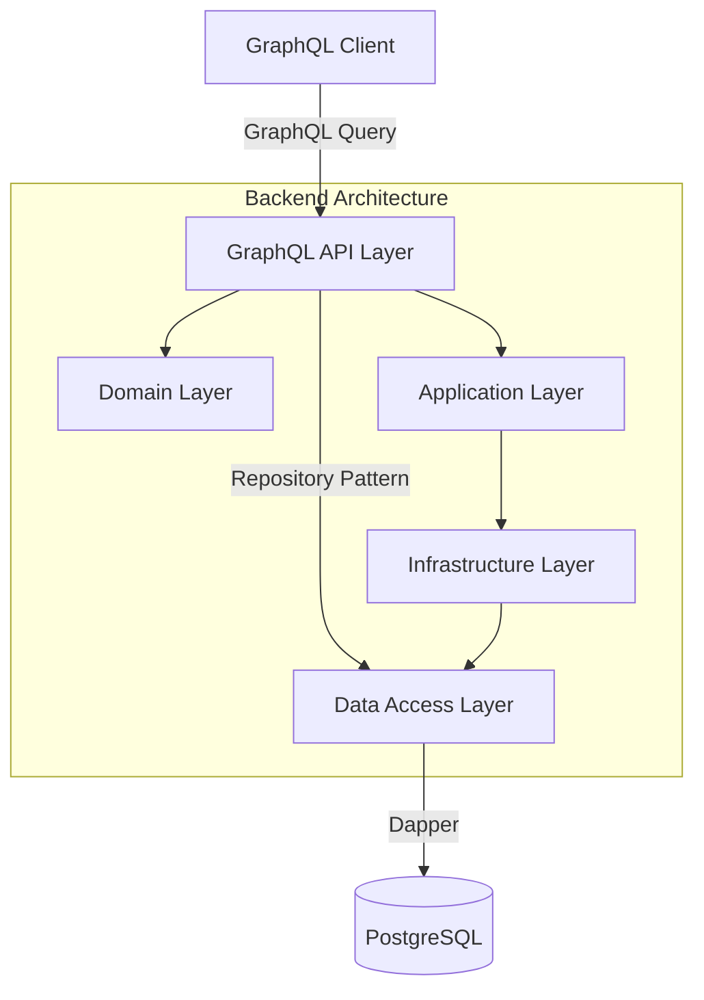
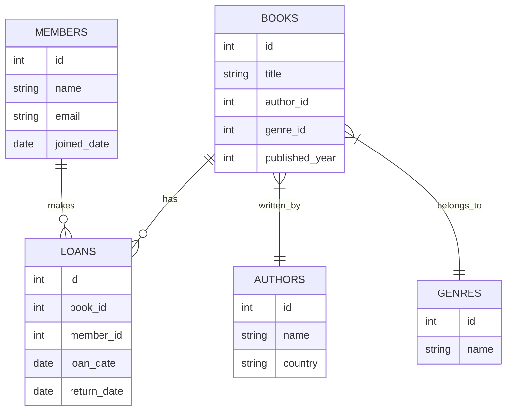
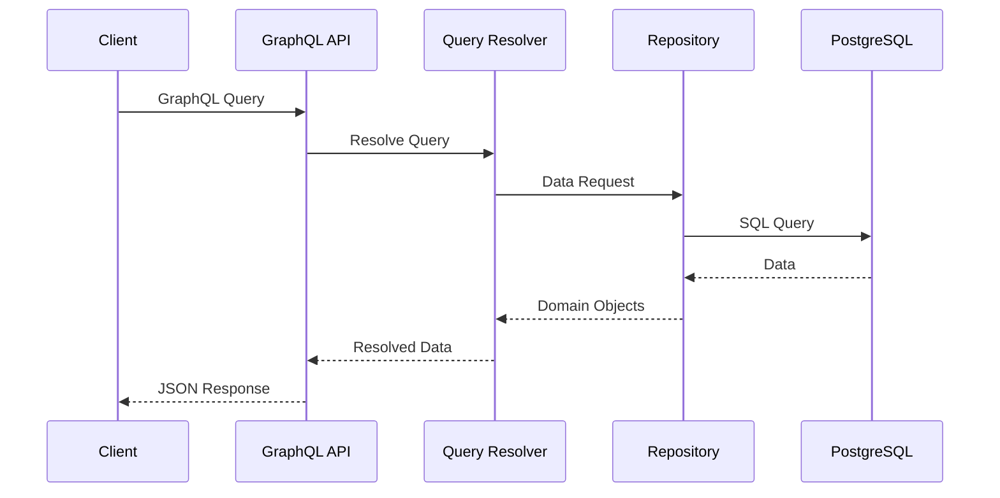

# GraphQL Library API

A modern GraphQL API built with .NET 8, HotChocolate, and PostgreSQL for managing a library system. This project demonstrates clean architecture principles and GraphQL implementation patterns.

## 🏗️ Architecture Overview



## 🎯 Features

- **GraphQL API** using HotChocolate
- **Clean Architecture** implementation
- **PostgreSQL** database with Dapper
- **Docker** support
- **Entity Framework-free** design using Dapper for optimal performance
- **Repository Pattern** implementation
- **Dependency Injection**

## 🔧 Tech Stack

- **.NET 8**
- **HotChocolate** (GraphQL Server)
- **Dapper** (Micro-ORM)
- **PostgreSQL** (Database)
- **Docker** (Containerization)

## 📊 Database Schema



## 🚀 Getting Started

### Prerequisites

- .NET 8 SDK
- Docker Desktop
- PostgreSQL
- PowerShell (for running scripts)

### Setup

1. **Clone the repository**
```sh
git clone https://github.com/yourusername/GraphQL-Notion.git
```

2. **Set up the database**
```sh
cd Build
./build-database.ps1
```

3. **Run the application**
```sh
cd src/Web
dotnet run
```

4. **Access GraphQL Playground**
Navigate to `https://localhost:7207/graphql`

## 📝 API Examples

### Query Books
```graphql
{
  books {
    id
    title
    publishedYear
  }
}
```

## 🐳 Docker Support

Build and run using Docker:

```sh
docker-compose up --build
```

## 🏗️ Project Structure

```
├── src/
│   ├── Web/                 # Main API project
│   │   ├── Application/    # Application layer (interfaces)
│   │   ├── Domain/        # Domain entities
│   │   ├── GraphQL/       # GraphQL types and schema
│   │   └── Infrastructure/ # Implementation details
├── Database/               # SQL scripts
├── Build/                  # Build and setup scripts
└── docker-compose.yml     # Docker composition
```

## 🔄 Request Flow



## 🛠️ Development

- Uses Central Package Management (CPM) for NuGet packages
- Implements repository pattern for data access
- Follows clean architecture principles
- Uses Dapper for efficient data access